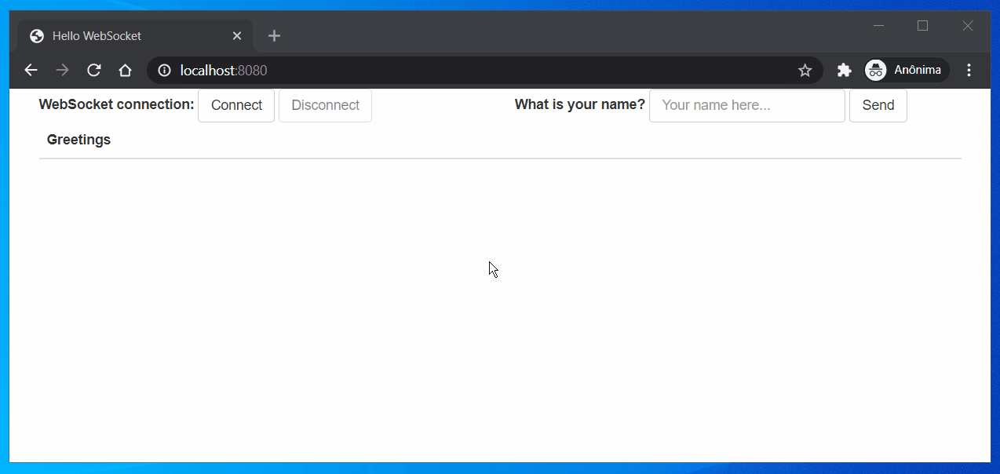

# Exemplo de aplicação interativa usando WebSocket e Spring

Essa aplicação tem um servidor que recebe mensagens que contêm nomes de usuários. Em resposta, o servidor envia uma saudação para uma fila na qual o cliente está inscrito. O servidor está programado para fazer um delay de um segundo para simular uma aplicação que está recebendo mensagens de um servidor remoto.

**Links**
- [Using WebSocket to build an interactive web application](https://spring.io/guides/gs/messaging-stomp-websocket/#scratch "Using WebSocket to build an interactive web application")

**Demo**

